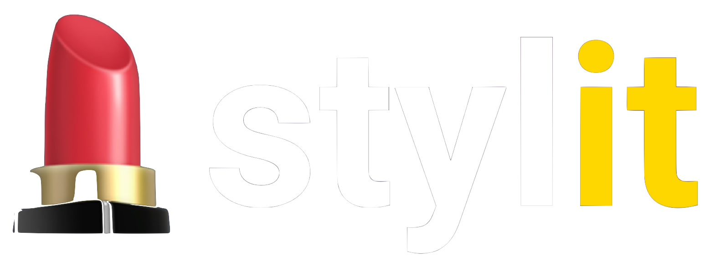

<div align="center">
  
</div>
<h1>
  <p align="center">
    Created by Blake Eriks 
    <a href="http://twitter.com/be_lockay">
       </img>
    </a>
  </p>
  <p align="center">
    <a href="https://github.com/blakeeriks/stylit/blob/master/LICENSE" target="blank">
      
    </a>
    <a href="https://github.com/blakeeriks/stylit/fork" target="blank">
      
    </a>
    <a href="https://github.com/blakeeriks/stylit/stargazers" target="blank">
      
    </a>
    <a href="https://github.com/blakeeriks/stylit/issues" target="blank">
      
    </a>
    <a href="https://github.com/blakeeriks/stylit/pulls" target="blank">
      
    </a>
    <a href="https://twitter.com/intent/tweet?text=Checkout%20%F0%9F%92%84stylit%20from%20%40be_lockay%20and%20browse%20more%20than%20100%20styled%20components%2C%20ready%20to%20be%20used%20in%20your%20next%20project!%20%F0%9F%8F%84%20%0A%0A%23DevCommunity%0A%0A&url=stylit.netlify.app"></a>
  </p>
  
</h1>

<p align="center"></p>


## 💄 Stylit

Stylit is a platform for creating and discovering CSS-styled HTML components that are ready to be used in your next project. Stylit has many customized creations from tons of talented developers. Select the component type you're looking for, filtering by popularity or creation, try out dark mode, publish new components for the world to see, and much more! Stylit is as awesome as people like you make it. 🤙

Make an account to get started, and get ready to take your styles to the next level!

## 🚀 Demo

<a href="https://stylit.netlify.app/" target="blank">
  
</a>
<p align="center">
  <a href="https://bitsi.netlify.app/">
    Live Link
  </a>
</p>

## 🔔 Features

Stylit was created for the creator - these features are to streamline the process of styling, so you can spend more time coding.

- 💯 **100+ Components** (and growing)
- 🎨 **Full Component Editor**
- 👓 **Style For Hover & Focus Styles**
- 🗒️ **Save Drafts For Later**
- 🏝️ **Component Explorer**
- 🎩 **Filter by Component** (3 Components)
- 🗓️ **Filter By Creation Date**
- 💗 **Filter By Popularity**
- 🌟 **Star Your Favorite Components**
- 👍 **Like The Best Components**
- 🖨️ **Ready to Copy styles**
- 🌘 **Dark mode**
- 💻 **Fully Responsive Page**
- 🔀 **Sign In With Google or Github**

## 🛠️ Installation Steps

1. Clone the repository

```bash
git clone https://github.com/BlakeEriks/stylit.git
```

2. Change the working directory

```bash
cd stylit
```

3. Install dependencies

```bash
npm install
```

4. Create `.env.local` file in root and add your variables

```bash
DATABASE_URL=YOUR_MONGO_DB_API_URL
```

5. Run the app

```bash
npm run start
```

## 📡 Tools & Technologies

- [NextJS](https://nextjs.org/) SSR + builtin express server
- [TypeScript](https://www.typescriptlang.org/) Typed JavaScript
- [Mongo Cloud](https://www.mongodb.com/cloud): Cloud Database-as-a-Service
- [Tailwind](https://tailwindcss.com/): easy drop in styles
- [lodash](https://lodash.com/): utility functions
- [react-icons](https://react-icons.github.io/react-icons/) clean icons
- [recoil](https://recoiljs.org/) state between components
- [react-color](https://casesandberg.github.io/react-color/) color picker
- [react-hot-toast](https://react-hot-toast.com/): action notifications
- [firebase](https://firebase.google.com/): user auth
- [date-fns](https://date-fns.org/): date distancing
- [Material UI](http://material-ui.com/): helpful, clean components
- [Animate.css](https://animate.style/): drop in css animations
- [AOS](https://michalsnik.github.io/aos/): scroll animations
- [Netlify](http://netlify.com/): for hosting

## 🍰 Contributing

There's two great ways to contribute to the Stylit community!

1. First is to create components on the editor and publish them for the world! Shoot for creativity and a style that you haven't seen yet on the app.

2. The second way is for developers! Anyone can contribute on any features or create one on their own. Make a pull request following the guidelines. Use the [GitHub Flow](https://guides.github.com/introduction/flow) model. Create a branch, add commits, and [open a pull request](https://github.com/blakeeriks/stylit/compare).

> Please read [`CONTRIBUTING`](CONTRIBUTING.md) for details on the [`CODE OF CONDUCT`](CODE_OF_CONDUCT.md), and the process for submitting pull requests.

## 📝 Planned Features

* Add gradients to background colors of components
* Inset option for shadows
* Optional private / public components
* Add ability to edit placeholder text styles in input components

